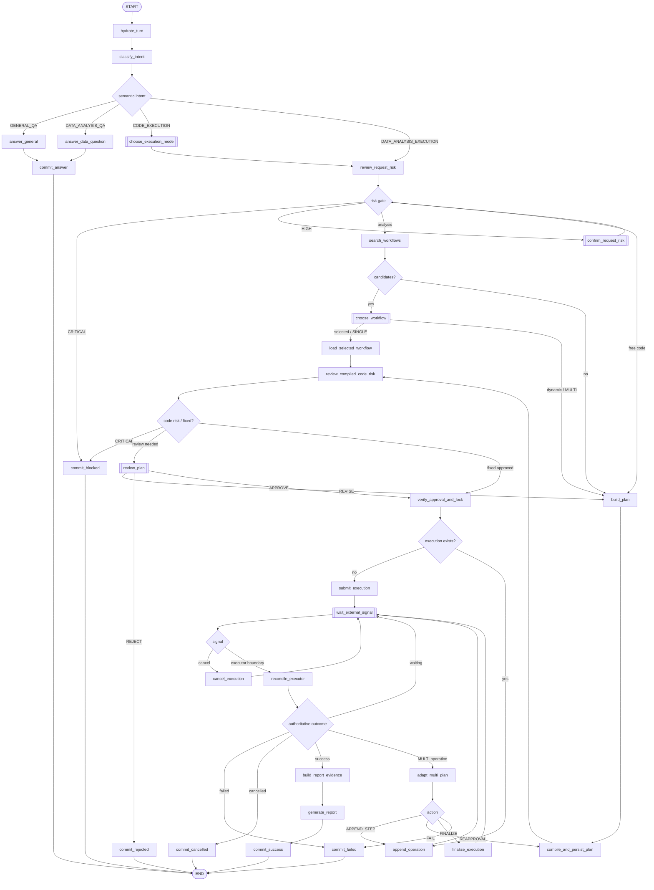

# LangGraph Workflow Design

상태: `ACCEPTED_IMPLEMENTED_V1`

이 문서는 승인된 V1 Agent workflow와 구현 경계를 기록한다.

## 1. 프레임워크 책임

```text
LangChain
  └─ create_agent, init_chat_model, embedding model, structured output,
     Skill/Tool context middleware, audit/guard middleware

LangGraph
  └─ 제품 상태 머신, intent 분기, HITL, SINGLE/MULTI loop, suspend/resume,
     실패/취소, 성공 리포트 lifecycle

Application services
  └─ DB transaction, session lock, outbox/inbox, idempotency, Executor REST,
     source compiler, result 검증, report renderer
```

최상위 orchestrator는 하나의 명시적 `StateGraph`다. LangChain `create_agent()`는 side effect
권한이 없는 planning leaf node 안에서만 호출하고 전체 workflow나 Executor lifecycle을 소유하지
않는다.

이유:

- 승인과 Session 잠금의 정확한 경계를 코드로 보장해야 한다.
- 5일 실행을 checkpoint/interrupt로 중단하고 외부 event에서 재개해야 한다.
- SINGLE/MULTI, 최대 3회 보정, report 생성 조건을 prompt가 아닌 graph edge로 강제해야 한다.
- 모든 PlanRevision과 Executor mapping을 결정론적으로 추적해야 한다.

## 2. V1에서 의도적으로 하지 않는 것

- stateful nested subgraph를 병렬 호출하지 않는다.
- `Send` 기반 병렬 실행을 사용하지 않는다. Jupyter Step은 순차 실행한다.
- Planner agent가 Executor나 shared workspace에 접근하지 않는다.
- LangChain `HumanInTheLoopMiddleware`를 제품 계획 승인에 사용하지 않는다. 제품 승인은 custom
  payload가 필요한 명시적 LangGraph `interrupt()` node가 맡는다.
- Deep Agents와 custom subagent를 V1 dependency에 포함하지 않는다.
- LangGraph checkpoint를 Frontend 대화 기록이나 감사 원본으로 사용하지 않는다.
- 장기 사용자 성향 memory는 V1에 넣지 않는다. BFF Message/Plan/Workflow가 영속 원본이다.

## 3. 전체 Graph



```text
START
  -> hydrate_turn
  -> classify_intent (LLM structured output)
  -> route_intent
       ├─ GENERAL_QA
       │    -> answer_general -> commit_answer -> END
       ├─ DATA_ANALYSIS_QA
       │    -> load_qa_skills -> answer_data_qa -> commit_answer -> END
       ├─ DATA_ANALYSIS_EXECUTION
       │    -> review_request_risk
       │    -> confirm_request_risk_if_high [HITL]
       │    -> search_promoted_workflows
       │         ├─ candidates
       │         │    -> prepare_workflow_proposals
       │         │       (bind + compile preview + risk + validate)
       │         │    -> choose_workflow [HITL]
       │         │         ├─ selected -> verify_selection_and_session_lock
       │         │         │              -> load_fixed_workflow_plan (SINGLE)
       │         │         │              -> materialize_approved_steps
       │         │         │              -> submit_execution -> wait_external_signal
       │         │         └─ declined -> dynamic_analysis_plan (MULTI)
       │         └─ no_match -> dynamic_analysis_plan (MULTI)
       └─ CODE_EXECUTION
            -> choose_execution_mode [HITL]
            -> review_request_risk
            -> confirm_request_risk_if_high [HITL]
            -> dynamic_custom_code_plan

dynamic execution plan branch
  -> build_plan
  -> compile_steps
  -> review_compiled_code_risk
  -> validate_plan
  -> persist_plan_revision
  -> review_plan [HITL]
       ├─ REVISE -> interpret_revision -> build_or_load_plan
       ├─ REJECT -> commit_rejection -> END
       └─ APPROVE -> verify_approval_and_session_lock
                      -> materialize_approved_steps
                      -> submit_execution
                      -> wait_external_signal [system interrupt]

SINGLE resume
  -> reconcile_executor
       ├─ running/non-boundary -> wait_external_signal
       ├─ cancelled -> commit_cancelled_and_unlock -> END
       ├─ failed -> commit_failure_and_unlock -> END
       └─ succeeded -> validate_execution_results -> success_report_flow

MULTI resume
  -> reconcile_executor
       ├─ operation succeeded
       │    -> validate_operation_result
       │    -> adapt_multi_plan
       │         ├─ APPEND_STEP within scope
       │         │    -> compile/risk/validate
       │         │    -> persist MULTI_ADAPTIVE revision
       │         │    -> append_operation -> wait_external_signal
       │         ├─ REQUIRE_REAPPROVAL
       │         │    -> review_plan [HITL, session remains locked]
       │         └─ FINALIZE
       │              -> finalize_execution -> wait_external_signal
       ├─ operation failed and correctable, correction_count < 3
       │    -> build_correction_step -> compile/risk/scope check
       │    -> append_operation -> wait_external_signal
       ├─ failed/not correctable/limit reached
       │    -> commit_failure_and_unlock -> END
       ├─ cancelled -> commit_cancelled_and_unlock -> END
       └─ execution succeeded -> validate_execution_results -> success_report_flow

success_report_flow
  -> build_report_evidence
  -> generate_report_narrative (LLM structured output)
  -> validate_report_references
  -> render_markdown (deterministic)
  -> materialize_report_in_executor
  -> prepare_optional_workflow_promotion_draft
  -> commit_success_message_and_unlock -> END
```

`requires_clarification=true`인 intent 결과는 해당 branch 전에 `clarify_request [HITL]`로 가며,
답변을 받은 뒤 최대 횟수 내에서 다시 `classify_intent`로 돌아간다.

승격 Workflow 선택은 별도 `review_plan`을 다시 거치지 않는다. 후보 card를 만들 때 binding,
Tool source version/hash, compile preview, 위험과 검증을 끝내고, 선택 transaction을 그 public
payload hash에 묶는다. 선택된 bundle은 승인 후 같은 hash로 materialize한다.

## 4. State 설계

Graph state는 control-plane snapshot이다. 대용량 결과, 전체 코드, 전체 Plan과 감사로그를 넣지
않고 authoritative record의 ID와 현재 routing에 필요한 작은 값만 둔다.

```text
AgentGraphState
  schema_version

  # identity
  user_id
  project_id
  session_id                 # BFF 대화 복원 및 세션 잠금 키
  active_task_id             # LangGraph thread_id와 동일
  current_input_message_id

  # control
  phase
  intent_decision
  clarification_count
  planning_kind              # FIXED_WORKFLOW | TOOL_PLAN | CUSTOM_CODE
  execution_mode             # SINGLE | MULTI | null
  runtime_profile            # initial: basic

  # retrieval / planning references
  workflow_search_id
  selected_workflow_version_id
  plan_id
  plan_revision_id
  plan_revision_number
  compiled_bundle_id
  request_risk_review_id
  code_risk_review_id
  approval_request_id

  # execution references
  execution_id
  current_operation_id
  last_executor_event_sequence
  current_plan_step_id
  correction_count
  execution_finalized

  # terminal/report references
  report_id
  report_artifact_id
  terminal_reason_code
```

원칙:

- Service/repository/client/model 객체는 state에 넣지 않고 `Runtime[AgentContext]`로 주입한다.
- PlanStep, compiled source, result manifest, Markdown은 ID/ref/hash만 state에 둔다.
- append-only 이력은 reducer로 checkpoint에 누적하지 않고 BFF domain table에 저장한다.
- 새 Task를 시작할 때 Task-scoped field는 명시적으로 초기화한다. 이전 Task 값이 다음 Task에
  섞이지 않게 한다.
- 동일 Session graph invocation은 PostgreSQL 기반 single-flight lease로 직렬화한다.

`AgentContext`가 제공할 port:

```text
unit_of_work / task_repository / message_repository / plan_repository
workflow_repository / skill_registry / tool_registry
model_provider / embedding_provider / risk_reviewer
source_compiler / executor_client / result_validator
report_renderer / event_outbox / clock / id_generator
```

## 5. Input과 resume 계약

Production graph는 async API/worker에 맞춰 `AsyncPostgresSaver`로 compile한다. Worker
bootstrap에서 `setup()`을 멱등적으로 수행하며 제품 테이블은 Alembic이 관리한다.
모든 invoke/stream/get-state 호출에 동일한 `thread_id=task_id`를
전달한다. task는 하나의 실행 요청부터 최종 리포트까지의
workflow 수명이다. 이렇게 해야 이전 task의 `execution_id`나 인터럽트가
같은 session의 다음 task로 누출되지 않는다. 세션 대화 복원과
잠금은 BFF/Agent PostgreSQL의 `session_id`로 관리한다.

새 사용자 turn은 일반 state input으로 시작한다.

```text
NewTurnInput
  task_id, message_id, user_id, project_id, session_id
```

중단된 graph는 항상 같은 `thread_id=task_id`와
`Command(resume=...)`로 재개한다. Resume
payload는 Pydantic tagged union이다.

```text
ResumeSignal
  ClarificationAnswer
  WorkflowSelectionDecision
  ExecutionModeDecision
  PlanReviewDecision
  ExecutorBoundarySignal
  CancelRequestedSignal
```

의미 intent는 LLM이 판단하지만 resume signal의 type, ID, version, hash와 권한은 결정론적으로
검증한다.

## 6. HITL node

### 6.1 단일 pending interrupt

V1에서는 한 Session에 동시에 하나의 interrupt만 허용한다. 병렬 interrupt/resume map은 쓰지
않는다.

### 6.2 사용자 interrupt

| Node | 사용자에게 표시 | 허용 결정 |
|---|---|---|
| `clarify_request` | 모호한 부분과 질문 | 답변 |
| `confirm_request_risk_if_high` | 코드/계획 생성 전 요청 위험 | 계속 또는 중단 |
| `choose_workflow` | 상위 3개 Workflow, Step/Skill/Tool/parameter/risk | 선택 또는 동적 계획 |
| `choose_execution_mode` | SINGLE/MULTI 의미 | 하나 선택 |
| `review_plan` | 설명, Skill/Tool, parameter, 선택 이유, 예상 결과, risk | APPROVE/REVISE/REJECT |

HIGH risk는 승인 payload에 별도 `risk_acknowledged=true`가 있어야 한다. CRITICAL은 interrupt를
만들지 않고 차단한다.

### 6.3 interrupt 안전 규칙

- `interrupt()`는 node에서 가장 먼저 실행되는 유효 동작이다.
- interrupt 전에는 DB insert, event 발행, Executor 호출을 하지 않는다.
- node resume 후에는 decision을 state에 반영하고 별도 idempotent node로 이동한다.
- `plan_revision`, proposal version, public payload hash가 현재 DB 값과 다르면 stale decision으로
  거절한다.

### 6.4 승인 transaction

계획 승인/Workflow 선택 API는 다음을 하나의 Agent DB transaction으로 저장한다.

```text
HumanDecision + approved payload hash
PlanRevision APPROVED
Session active_task lock
durable ResumeCommand + outbox event
```

Worker가 command를 claim한 뒤 `Command(resume=decision)`을 호출한다. Graph의
`verify_approval_and_session_lock`은 위 transaction이 존재하고 현재 revision/hash와 일치하는지
확인한다. Executor 제출은 그 다음 별도 node다.

REVISE/REJECT/clarification은 실행 잠금을 잡지 않는다. MULTI 실행 중 재승인은 기존 잠금을
유지한다.

## 7. API와 worker 실행

| Graph 구간 | 기본 실행 주체 | 이유 |
|---|---|---|
| 새 turn, intent, QA, 최초 계획 | worker container | HTTP 수명과 LLM 지연을 분리 |
| clarification/revise/reject resume | worker container | 모든 resume를 durable 경로로 처리 |
| 승인/Workflow 선택 이후 | worker container only | lock 이후 durable lifecycle 보장 |
| Executor event/cancel/recovery resume | worker container only | at-least-once 처리와 직렬화 |

API는 모든 command를 먼저 PostgreSQL에 저장하고 Redis Stream에 발행한 뒤 `202`를 반환한다.
Worker만 Graph를 invoke/resume한다. Redis 발행에 실패한 PENDING command는 relay loop가
재발행한다. 승인 resume transaction은 Session lock과 command를 함께 저장한다.

## 8. LangChain `create_agent` planner 설계

### 8.1 역할

Planner agent는 다음만 한다.

- Middleware가 제공한 관련 Skill과 Tool manifest를 읽는다.
- 사용자 요청/이전 MULTI 결과 요약을 근거로 계획안을 만든다.
- 각 Step의 `skill_ref`, `tool_ref`, parameter, 선택 이유, 기대 결과와 검증 기준을 제안한다.
- 자유 코드 계획이면 함수 정의와 한 번의 호출을 포함한 code draft를 제안한다.

다음은 하지 않는다.

- Executor REST 호출
- BFF/Executor DB mutation
- shared workspace/Jupyter filesystem 접근
- Session 잠금 또는 사용자 승인 처리
- Workflow 승격

### 8.2 실행 Tool과 LangChain Tool의 구분

`fetch_dataset`, `inspect_dataset`, `group_aggregate` 등은 Jupyter에서 실행될 domain execution
Tool이다. Planner의 LangChain callable Tool로 등록하지 않는다. 모델이 planning 중 이 함수를
호출하면 실제 데이터를 처리한 것처럼 ToolMessage가 생겨 책임 경계가 흐려지기 때문이다.

```text
Execution Tool catalog
  SKILL.md + ToolManifest + canonical Python source
  -> middleware가 Skill/manifest context만 planner에 제공
  -> planner는 PlanDraft에서 tool_ref/parameter를 선택
  -> application이 exact source를 bind/compile
  -> 승인 후 Executor가 Jupyter에서 실행
```

V1 `create_agent()`는 기본적으로 `tools=[]`를 사용한다. 향후 planner가 외부 metadata를 능동
조회해야 할 때만 side effect 없는 read-only lookup Tool을 추가하고 `ToolPolicyMiddleware`로
allowlist한다.

### 8.3 Middleware stack

| Middleware | Hook | 책임 |
|---|---|---|
| `PlanningContextMiddleware` | `before_agent` | Task/PlanRevision/이전 결과 ref를 읽어 bounded planning context 구성 |
| `SkillContextMiddleware` | `before_agent` / `before_model` | Skill frontmatter를 대상으로 별도 LLM structured selection을 수행하고 선택 후보의 version/hash와 `.md` 내용을 동적 system prompt에 주입 |
| `ToolCatalogMiddleware` | `before_model` | 후보 Skill에 연결된 ToolManifest/schema/version/hash를 주입; canonical source는 주입하지 않음 |
| `RiskPrerequisiteMiddleware` | `before_model` | 명시적 graph risk gate를 통과한 request인지 검증; 아니면 model 호출 short-circuit |
| `ModelAuditMiddleware` | `wrap_model_call` | model/provider/template/registry snapshot, trace, token/latency 기록 |
| `PlannerBudgetMiddleware` | `wrap_model_call` | timeout, model call/iteration/context budget 강제 |
| `PlanOutputMiddleware` | `after_agent` | `response_format` 검증 이후 domain reference와 공개 rationale 필드를 추가 검증 |
| `ToolPolicyMiddleware` | `wrap_tool_call` | 미래의 read-only lookup Tool만 허용; Executor/DB mutation/shared filesystem Tool 차단 |

Skill middleware는 전체 Skill frontmatter에서 별도 LLM structured output으로 관련 후보를
선정하고 본문 context를 제공한다. Skill 수가 커질 때만 embedding prefilter를 앞에 추가할 수
있다. 최종 Skill/Tool 선택은 Planner Agent의 `PlanDraft`에 나타나며 application validator가
registry와 대조한다. Skill 후보/최종 선택 모두 공개 가능한 이유와 model/template/registry
snapshot을 기록하고 keyword/rule routing은 사용하지 않는다.

### 8.4 `create_agent` 구성

```text
create_agent(
  model=init_chat_model(...),
  tools=[],
  middleware=[
    PlanningContextMiddleware,
    SkillContextMiddleware,
    ToolCatalogMiddleware,
    RiskPrerequisiteMiddleware,
    ModelAuditMiddleware,
    PlannerBudgetMiddleware,
    PlanOutputMiddleware,
    ToolPolicyMiddleware,
  ],
  response_format=PlanDraft,
)
```

Planner agent 자체에는 별도 checkpointer를 주지 않는다. Parent LangGraph가
`AsyncPostgresSaver`로 lifecycle을 저장하고, planner 호출은 PlanRevision input마다 fresh하게
실행한다. Middleware가 필요한 authoritative context는 Agent DB에서 다시 읽는다.

### 8.5 출력 검증

Agent의 자연어 final answer를 실행계획으로 직접 사용하지 않는다.

```text
create_agent structured_response
  -> Pydantic PlanDraft parse
  -> Skill/Tool registry lookup
  -> parameter schema validation
  -> source version/hash binding
  -> deterministic compiler
  -> code risk review
  -> plan invariant validation
  -> PlanRevision persistence
```

Planner agent는 독립 memory/interrupt가 필요 없으므로 persistent stateful subgraph로 만들지
않는다. 호출 input hash와 model/prompt/middleware/registry snapshot을 감사 테이블에 저장한다.

## 9. 계획과 코드 생성

### Tool 기반 Step

```text
LLM: Skill/Tool/parameter/선택 이유 제안
ToolRegistry: exact source/version/hash 반환
Compiler: canonical function definition + validated one-time call 생성
```

LLM이 registered Tool 구현을 다시 작성하지 않는다.

### CUSTOM_CODE Step

```text
LLM: function definition + invocation code 생성
Validator: AST/schema/size/one-function-one-call 규칙 검증
Risk reviewer: 생성된 code 평가
Compiler: normalized source와 hash 생성
```

### MULTI 초기 계획

초기 승인은 전체 분석 전략, 예상 단계와 첫 번째 concrete executable Step을 포함한다. 이전 cell
결과가 필요한 후속 Step의 실제 parameter/code는 결과를 본 뒤 `MULTI_ADAPTIVE` revision으로
생성한다.

## 10. 위험 node

위험 판단은 middleware에만 숨기지 않고 두 개의 명시적 graph node로 둔다.

1. `review_request_risk`: code/plan 생성 전 사용자 요청과 parameter의 위험 평가
2. `review_compiled_code_risk`: 실행 전 exact compiled source와 parameter의 위험 평가

```text
LOW      -> 진행
MEDIUM   -> 다음 승인 payload에 경고
HIGH     -> 요청 단계면 생성 전 확인, code 단계면 실행 승인 시 별도 acknowledgement
CRITICAL -> 차단 메시지 저장 후 END
```

LangChain middleware는 context/Skill/Tool manifest 주입, model audit, timeout/budget과 graph risk
gate 통과 여부 강제를 맡는다. 사용자에게 보여야 하는 위험 판정과 분기는 명시적 graph node가
소유한다. LLM 위험 판정은 advisory이며 sandbox나 실제 권한 경계가 아니다.

## 11. Executor suspend/resume

`submit_execution`, `append_operation`, `finalize_execution`, `cancel_execution`,
`materialize_report`는 각각 독립된 side-effect node다. 모든 mutation은 안정적인 idempotency key를
사용한다.

제출 후 `wait_external_signal` node가 다음 payload로 interrupt한다.

```text
WaitDescriptor
  task_id
  execution_id
  expected_boundary
  last_event_sequence
  cancellable
```

이 node는 `interrupt()` 전에 외부 mutation을 하지 않는다. Worker slot과 HTTP connection은
종료된다.

Executor event subscriber는 graph 밖의 deterministic adapter다.

```text
XREADGROUP executor.events
  -> event_id dedupe
  -> execution별 event_sequence 정렬/gap 검사
  -> gap이면 Executor REST event history 복구
  -> Agent inbox/checkpoint와 product event projection commit
  -> operation_completed/execution.completed 경계에서만 ResumeCommand/outbox 생성
  -> ACK
```

`execution.started`, `execution.operation_started`, `execution.step_started`,
`execution.step_completed`는 진행 상태와 사용자 product event를 갱신하지만 graph를 깨우지 않는다.
Graph resume이 필요한 경계는 MULTI의 `execution.operation_completed`와 terminal
`execution.completed`다.

Workflow worker가 Task single-flight lease를 얻어 graph를
`Command(resume=ExecutorBoundarySignal(...))`로 재개한다. Graph는 event payload만 믿지 않고
`reconcile_executor`에서 REST authoritative state를 다시 조회한다.

## 12. SINGLE 상태 전이

```text
APPROVED + LOCKED
  -> compile all approved steps
  -> POST execution(SINGLE)
  -> WAIT_EXECUTOR_COMPLETED
  -> REST reconcile
       SUCCEEDED -> result validation -> report
       FAILED    -> failure message -> FAILED + unlock
       CANCELLED -> cancel message -> CANCELLED + unlock
```

실패 시 code 자동 수정이나 새 Execution을 만들지 않는다. Executor transport 재시도만 동일
idempotency key로 제한 적용한다.

## 13. MULTI 상태 전이

```text
APPROVED strategy + first concrete step + LOCKED
  -> POST execution(MULTI, operation 0)
  -> WAIT_OPERATION_BOUNDARY
  -> result validation
  -> planner decision:
       APPEND_STEP | FINALIZE | REQUIRE_REAPPROVAL | FAIL
  -> append/finalize
  -> WAIT...
```

규칙:

- Operation당 executable Step 하나를 기본으로 한다.
- 각 후속 Step은 새 `MULTI_ADAPTIVE` PlanRevision으로 append한다.
- 이전 `result_ref`와 Step을 생성한 공개 가능한 이유를 기록한다.
- 승인 전략 범위 안의 후속 Step은 자동 실행한다.
- 목적/방법의 중대한 변경, 새 data access, risk 상승, 새 external side effect는 재승인한다.
- 실행 오류 자동 보정은 Task당 최대 3회다. 보정 Step도 별도 revision과 rationale을 가진다.
- 더 수행할 Step이 없으면 Executor finalize 후 최종 `execution.completed`를 기다린다.

## 14. 취소 race

취소 API transaction:

```text
Task -> CANCEL_REQUESTED
CancelCommand + outbox 저장
Session lock 유지
```

Worker는 현재 wait interrupt를 `CancelRequestedSignal`로 재개하고 `cancel_execution`을 호출한 뒤
다시 system interrupt로 들어간다. 완료 event가 취소보다 먼저 도착하면 REST state를 기준으로
다음처럼 결정한다.

- Executor가 이미 SUCCEEDED이면 성공/report flow를 계속한다.
- Executor가 CANCELLED이면 취소 메시지를 저장한다.
- 아직 terminal이 아니면 CANCEL_REQUESTED를 유지하고 기다린다.

사용자에게 취소 완료를 알리기 전에는 잠금을 풀지 않는다.

## 15. 성공 리포트

리포트 node를 하나의 LLM call로 합치지 않는다.

```text
validate_execution_results         # deterministic
build_report_evidence              # authoritative Plan/Executor assembler
generate_report_narrative          # LLM structured output
validate_report_references         # deterministic
render_markdown                    # deterministic section renderer
materialize_report_in_executor     # REST, idempotent
commit_success_message_and_unlock  # Agent DB transaction
```

Executor Execution 성공만으로 Agent Task를 성공 처리하지 않는다. Report Artifact, 완성된
Assistant message, user event, Task `SUCCEEDED`, Session unlock이 commit되어야 한다. 영구적인
report 실패는 report 없이 “실행은 성공했지만 결과 리포트 생성/저장에 실패” 메시지를 저장하고
Task를 `FAILED`로 종료한 뒤 잠금을 푼다.

Tool-only 성공 Task에는 별도의 promotion draft를 저장해 최종 응답에 제안한다. 실제 승격은
사용자의 후속 명령과 `PromotionPolicy`를 거치는 별도 application flow다. Promotion draft 생성은
best-effort이며 실패해도 성공 report를 실패 처리하지 않는다. Session unlock은 graph의 마지막
terminal commit에서 수행한다.

## 16. 오류 전략

| 오류 | 처리 |
|---|---|
| LLM/embedding rate limit, 일시적 network | node `RetryPolicy`, 제한 횟수 |
| Executor REST transport error | 같은 idempotency key로 backoff retry |
| MULTI cell의 분석/코드 오류 | 결과를 planner에 전달, 최대 3회 correction |
| 사용자 입력 부족/계획 승인 | `interrupt()` |
| stale decision/version/hash | 409 계열 product error, 최신 proposal 반환 |
| event duplicate/gap | subscriber dedupe/REST history recovery |
| schema/invariant 위반 | 실행 전 차단, 안전한 실패 메시지 |
| 예상하지 못한 developer error | bubble + recovery retry; 최종 실패 시 메시지/잠금 해제 |

자동 retry 대상 node에는 비멱등 mutation을 넣지 않는다. DB/Executor mutation node는 자체
idempotency key와 application-level retry를 사용한다.

## 17. Streaming과 product event

Graph streaming은 다음처럼 사용한다.

- `messages`: foreground Q&A의 token delta
- `custom`: 계획 생성 단계 같은 일시적 진행 표시
- `updates`: 내부 진단/테스트, Frontend public contract로 직접 노출하지 않음

Token delta는 transient다. 완성된 Assistant message와 주요 product event만 Agent DB에 저장한다.
SSE reconnect는 DB event sequence를 재생하고, 완성 전 연결이 끊긴 답변은 Task snapshot으로
복구하거나 안전하게 재생성한다.

Executor raw event는 Frontend로 직접 보내지 않고 `execution.submitted`, `step.completed`,
`task.failed` 같은 versioned product event로 projection한다.

## 18. 동시성과 불변조건

반드시 테스트할 불변조건:

1. 같은 `session_id`에서 동시에 하나의 graph invocation만 실행된다.
2. 승인 전에는 Executor mutation이 없다.
3. 승인 transaction과 Session lock은 분리되지 않는다.
4. 같은 PlanRevision/hash가 아니면 승인/제출할 수 없다.
5. 하나의 승인된 논리 제출은 최대 하나의 Executor Execution을 만든다.
6. `last_executor_event_sequence` 이하 event는 graph를 중복 진전시키지 않는다.
7. MULTI Step은 이전 Step sequence 뒤에만 append된다.
8. correction은 최대 3회다.
9. 실패/취소에는 Report Artifact가 없다.
10. 성공은 Report Artifact와 사용자 메시지 저장 전에는 성립하지 않는다.
11. terminal 사용자 메시지와 상태 저장 전에는 Session lock을 풀지 않는다.
12. 실제 실행 source는 승인된 tool/code source hash와 일치한다.

## 19. Graph 구성 단위

코드는 다음 경계로 나눈다.

```text
agent/graph/state.py              # graph state와 resume union
agent/graph/builder.py            # node/edge wiring only
agent/graph/routes.py             # pure conditional routing
agent/graph/nodes/                # node adapters, 얇게 유지
agent/planners/                   # create_agent와 PlanDraft
agent/middleware/                 # Skill/context/policy/audit/budget middleware
agent/domain/                     # Task/Plan/Workflow invariant
agent/application/                # transactional use cases
agent/adapters/postgres/          # repositories/checkpointer/store
agent/adapters/redis/             # outbox relay/event subscriber
agent/adapters/executor/          # REST client/reconciliation
agent/tools/                      # canonical Tool source/manifest/compiler
agent/api/                        # FastAPI/SSE/IdentityProvider
```

`builder.py`에는 business mutation을 넣지 않고 graph topology만 둔다. Node는 state에서 ID를 읽고
application service를 호출한 뒤 작은 state update 또는 `Command`를 반환한다.

## 20. 설계 승인 항목

코드 작성 전 다음을 승인받는다.

1. 하나의 명시적 top-level LangGraph + middleware 중심 `create_agent` planner 구조
2. `thread_id=task_id`, 한 Session 한 invocation/한 pending interrupt 정책
3. Workflow 선택=SINGLE, 동적 분석=MULTI, 자유 코드=사용자 mode 선택
4. 승인 transaction 후 worker-only 실행 전환
5. 외부 Executor event도 `interrupt`/`Command(resume=...)`로 재개
6. MULTI의 Step별 adaptive revision과 최대 3회 correction
7. 성공 report 완료 전 잠금 유지, 실패/취소 report 없음
8. V1에서 Deep Agents/stateful subagent/병렬 Step/장기 사용자 memory 제외
