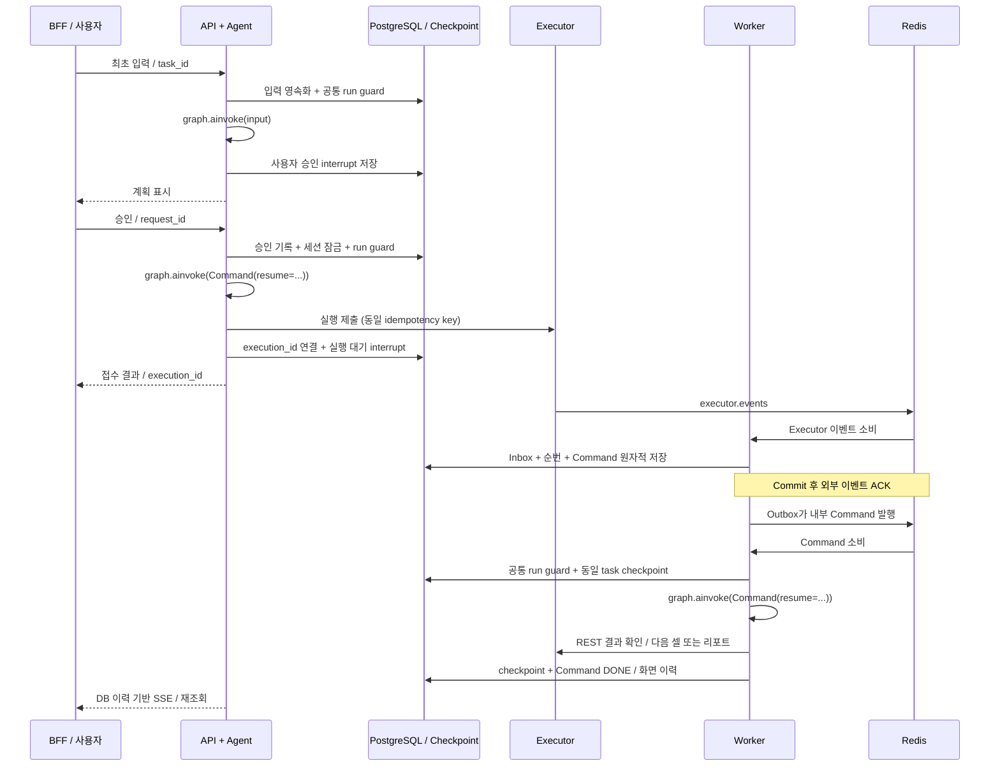

# Worker 인수인계: API+Agent / Background Worker

> 최신 전달물은 [독립 Worker 모듈](../standalone_worker/README.md)이다.
> 실제 독립 DB 구현과 `session_id = thread_id` 예제를 포함한다.
> 아래 문서는 이전 Task 기반 연결 예제의 참조 기록이며, 새 모듈의 설치
> 절차나 현재 스레드 ID 정책으로 사용하지 않는다.

작성일: 2026-08-31. 현재 서비스 참조 기준: `main`, `5099c2a`.

대상은 **FastAPI 라우터에서 Agent를 직접 호출**하는 기존 개발자다.
자기 Agent를 유지하고, Executor 이벤트 소비·내구성·그래프 재개 부분을
이식하는 방법을 설명한다. 배포용 SDK 제작이나 Agent 교체가 목적은 아니다.
파일 경로는 저장소 루트 기준이다.

> 이번 작업은 연결 예제와 인수인계 자료를 추가한다. 현재 ex-agent의 API가
> Worker에 START/RESUME을 맡기는 실행 구조는 변경하지 않았다.
> 현재 구현 설명은 [기존 서비스 참조](worker-reference-implementation.md),
> 새 서비스에 적용할 기준은 위 **독립 Worker 모듈** 문서다.

## 1. 확정할 실행 책임

| 구성 | 책임 |
|---|---|
| API+Agent | 최초 입력, 사용자 승인/수정으로 직접 graph invoke/resume |
| Worker | Executor 이벤트 접수, 내구성 있는 Command 처리, graph resume |
| 공통 Agent 모듈 | 그래프/상태/노드 정의, Executor 호출, 재개 검증 |
| PostgreSQL | Task/입력 이력, Inbox/Command/Outbox, checkpoint, 화면 이력 |
| Redis | Stream 전달, 소비 lease, 상태 변경 알림 |
| Executor | 코드 실행과 결과/노트북/아티팩트 저장 |

- API와 Worker는 **같은 Pod의 서로 다른 컨테이너**로 실행한다.
- 동일한 Agent 코드를 각 프로세스에서 로드한다. Python 객체를 공유하는
  것이 아니라 **같은 PostgreSQL checkpoint**를 공유한다.
- 최초 실행·사용자 승인은 API, Executor 결과에 따른 재개는 Worker가
  담당한다. 이 문서에서는 Worker가 API를 HTTP 호출해 재개하지 않는다.
- `thread_id=str(task_id)`를 양쪽에서 동일하게 사용한다. `session_id`로
  바꾸면 현재 Task 단위 계약과 달라지므로 임의 변경하지 않는다.
- 코드 실행 시작 전부터 성공 리포트 게시 완료 또는 실패/취소 확정까지
  세션을 잠근다. 며칠짜리 실행 동안 HTTP 요청이나 run lock은 유지하지 않는다.
- 취소는 Executor의 취소 완료까지 확인한다. 성공만 리포트를 만들고,
  실패/취소는 해당 내용을 알린다. 이 업무 정책은 기존 Agent가 구현한다.

## 2. 전체 흐름



첫 소비는 짧은 DB 접수, 두 번째 소비는 길어질 수 있는 Agent 처리다.
Inbox/Command/Outbox의 원자적 저장은 유지한다. API 직접 호출로 바뀌어도
Executor 이벤트의 유실·재전달 문제는 없어지지 않는다.
Outbox 뒤에 다시 Outbox를 추가하는 무한 구조가 아니다.

### 기존 API 코드를 그대로 붙이면 안 되는 부분

현재 `src/ex_agent/persistence/repositories/tasks.py`의 `create_task()`는
START Command까지 만들고, `create_resume_command()`는 사용자 RESUME을
큐에 넣는다. **이 경로와 API 직접 invoke를 함께 사용하면 안 된다.**

대상 서비스는 Task 생성/입력 저장을 자체 트랜잭션으로 구성하고,
최초 입력·승인에는 START/RESUME Command를 발행하지 않는다.
Worker의 실행 큐에는 Executor 경계에서 파생된 `EXECUTOR_SIGNAL`을 넣는다.
취소/관리 명령은 별도 계약으로 추가할 수 있으나 예제에는 포함하지 않는다.

API 직접 호출도 요청 유실 대비가 필요하다. 응답 전 프로세스가 죽을 수 있으므로
호스트 서비스가 `request_id` 기반 입력 원장과 처리 상태를 영속화하고,
미완료 요청의 재개 책임자를 정해야 한다. 최소한 동일 ID로 재요청할 수 있어야
한다. 자동 복구가 필요하면 API 측 복구 루프 등 **한 곳**이 소유하게 한다.
checkpoint를 저장했다는 이유만으로 멈춘 그래프가 자동 실행되지는 않는다.
이 인수인계 예제에 입력 원장/자동 복구 스케줄러는 구현되어 있지 않다.

## 3. 전달할 코드

| 전달 대상 | 상태와 용도 |
|---|---|
| `src/ex_agent/transport/consumer.py` | 그대로 복사 가능한 Redis 소비 기반 |
| `examples/api_agent_worker/` | API 직접 실행 + Worker 재개 연결 예제 |
| `examples/durable_event_to_langgraph/contracts.py` | 예제 Command 모델 |
| `examples/durable_event_to_langgraph/ports.py` | 예제가 상속하는 CommandStore |
| `tests/test_api_agent_worker_example.py` | 경계·중복·실패 복구 회귀 테스트 |
| `tests/test_api_agent_worker_postgres.py` | 별도 saver 연결의 실제 PG 복구 검사 |
| `deploy/handoff/` | 같은 Pod의 두 컨테이너 배포 템플릿 |

예제 실행/테스트까지 가져가려면 기존 예제의 `memory_store.py`도 필요하다.
운영에는 메모리 구현을 가져가지 않는다. 패키지 경로는 이식할 서비스에 맞춰
수정한다. 예제의 `workflow_id`는 재사용 워크플로우 ID가 아니라
**이 실행의 task_id 문자열**이다.

`consumer.py`의 외부 의존성은 `redis`다. `transport/__init__.py` 전체나
서비스 전용 `streams.py`까지 복사할 필요는 없다. DLQ 조회/재처리와 retention
관리가 필요하면 같은 디렉터리의 관리 모듈을 함께 검토한다.

구체적인 실행 방법과 어댑터는
[API+Agent / Worker 예제](../examples/api_agent_worker/README.md)를 따른다.
분석 함수·Skill·프롬프트는 기존 개발자의 Agent를 사용한다.

### 그대로 복사하지 않고 참고·이식할 기존 서비스 코드

| 파일/영역 | 가져올 정책 |
|---|---|
| `workers/executor_events.py` | 이벤트 분기, 실행 연결, 누락 순번 복구 |
| `persistence/repositories/executions.py`, `commands.py` | Inbox/Command DB 처리 |
| `transport/streams.py`, `persistence/repositories/delivery.py` | Outbox 전달 복구 |
| `workers/commands.py`, `workers/checkpoints.py` | 실행 소유권, checkpoint 연결 |
| `workers/runtime.py` | 소비 루프, pool, 종료/지표 구성 |
| `api/routers/tasks.py` | 화면 이력 복원/SSE 참조 |

위 경로는 `src/ex_agent/` 아래다. 실제 저장소 분리는
[현재 서비스 참조](worker-reference-implementation.md)와
[소비기 계약](redis-stream-consumer.md)을 함께 확인한다.
기존 DB 구현은 Agent 도메인에 연결되어 있어 독립 SDK처럼 즉시 연결되지는 않는다.

## 4. 이벤트와 resume 계약

진행 이벤트 `execution.started`, `execution.operation_started`,
`execution.step_started`, `execution.step_completed`는 화면 이력에 반영한다.
매 진행 이벤트로 그래프를 재개하지 않는다.

재개 경계는 `execution.operation_completed`, `execution.completed`다.
MULTI의 다음 계획은 개별 Redis step 이벤트가 아니라 확정된 operation 결과를
기준으로 판단한다. 성공/실패는 이벤트 이름만 보지 않고 Executor REST로 확인한다.
API가 execution/task 연결을 아직 저장하지 못한 조기 이벤트는 ACK로 버리지 않고
재시도한다. 이벤트 순번 누락은 기존 REST 이력 복구 정책을 이식한다.

내부 Command Stream의 실제 형태는 다음과 같다. `payload`는 Redis에서
JSON **문자열**이다. 아래 `<...>`는 설명용 자리표시자다.
소비 Handler는 ID로 DB Command를 읽어 권위 있는 내용을 쓴다.

```json
{
  "command_id": "00000000-0000-0000-0000-000000000003",
  "task_id": "00000000-0000-0000-0000-000000000001",
  "command_type": "EXECUTOR_SIGNAL",
  "payload": "<아래 boundary 객체를 JSON 문자열로 직렬화>"
}
```

payload를 펼치면 다음과 같다. 코드·전체 stdout·분석 결과를 Redis에 다시 싣지 않는다.

```json
{
  "type": "EXECUTOR_BOUNDARY",
  "execution_id": "00000000-0000-0000-0000-000000000002",
  "event_id": "00000000-0000-0000-0000-000000000004",
  "event_sequence": 5,
  "event_type": "execution.operation_completed"
}
```

새 예제의 Runner는 여기에 `kind`, `action_id`, `fingerprint`, `payload`를
붙인 **그래프 내부 action**을 만들고 해당 interrupt ID를 지정해 재개한다.
이 action은 Executor나 Redis의 새 외부 프로토콜이 아니다.
기존 Agent가 다른 resume 스키마를 쓰면 Runner와 wait 노드를 함께 맞춘다.

## 5. 세션 잠금과 실행 잠금을 구분한다

| 장치 | 막는 문제 | 유지 범위 |
|---|---|---|
| Session lock | 코드 실행 중 사용자가 새 작업을 시작 | 제출 전부터 최종 처리까지 |
| Task RunGuard | API와 Worker가 같은 checkpoint를 동시에 쓰기 | 한 번의 invoke/resume 동안 |
| Inbox + Command receipt | 동일 이벤트/명령 재전달로 재실행 | 영속 중복 방지 기록 |

세션 잠금 때문에 같은 Task가 새로 생성되지 않아도 기존 Task에 대한 승인 재전송,
조기 Executor 이벤트, Worker 재전달은 발생한다. 이 세 장치는 서로 대체하지 않는다.
기존 서비스에 같은 범위의 원자적 잠금이 있다면 재사용하고 중복 구현하지 않는다.

API와 Worker는 **동일한 키 규칙과 공유 저장소**의 RunGuard를 사용한다.
API는 입력 승인부터 checkpoint 저장까지, Worker는 Command 조회부터
checkpoint 저장과 DB DONE까지 잡는다. 다음 interrupt에서 반환하면 해제한다.
lease 방식이면 주기 갱신과 소유권 상실 시 실행 중단이 필수다.
`asyncio.Lock`은 다른 컨테이너를 막지 못하므로 운영 구현이 아니다.

새 Handler의 `lock_key()`가 `None`인 이유는 내부의 공통 RunGuard가 양쪽을
직렬화하기 때문이다. 소비기에 같은 task lock을 또 넣으면 이중 획득될 수 있다.
메시지 PEL lease 갱신은 공통 소비기가 계속 담당한다.
RunGuard는 동시 실행만 막으므로 **명령 순서 보장은 DB가 별도로 담당**한다.

## 6. 내구성과 재시도 규칙

1. Inbox 중복 키는 Redis entry ID가 아니라 Executor `event_id`다.
   현재 서비스는 `event:{event_id}`를 저장한다.
2. Inbox·연속 순번·실행할 Command·화면 이력을 같은 트랜잭션으로 확정한다.
   현재 Command 테이블이 Outbox 역할도 겸한다. 별도 테이블이 필수는 아니다.
3. commit 이후에 외부 이벤트를 ACK한다. Outbox는 같은 `command_id`로 발행한다.
4. 소비 시 Stream payload를 신뢰하지 않고 DB Command/task 연결을 확인한다.
5. Task별 다음 실행 가능한 Command만 전달한다. 후속 Command가 먼저 도착하면
   RETRY한다. 진행 이벤트가 사이에 있으므로 경계 이벤트의 순번은 비연속일 수 있다.
6. interrupt 종류를 검사해 이벤트가 사용자 승인을 대신하지 못하게 한다.
7. checkpoint에 action ID와 내용 fingerprint를 남긴다. 마지막 ID 하나만으로
   과거 Command의 늦은 재전달을 처리하지 않는다.
8. wait 노드는 통과했지만 후속 노드가 실패했다면 동일 pending action인지
   확인하고 `ainvoke(None)`으로 이어간다. 새 resume을 덮어 넣지 않는다.
9. checkpoint 완료 후 DB DONE 저장이 실패하면 receipt로 재실행을 생략한다.
10. 외부 제출 등 부수 효과는 별도 idempotency key가 필요하다.
    checkpoint와 Executor는 하나의 트랜잭션이 아니다.

작업 종료 뒤 같은 execution의 후속 경계 이벤트가 도착할 수도 있다.
예제는 이미 확정된 종료 상태를 다시 열지 않고 receipt만 남긴다.
실제 Agent에서는 **리포트까지 완료된 업무 종료 상태**에만 이 정책을 적용한다.
중복 방지가 외부 부수 효과의 무조건적인 exactly-once 실행을 보장하지는 않는다.

### 재시도 책임자는 하나

새 연결 예제는 Command 처리 실패 시 DB 상태를 재시도 가능하게 바꾸고
Redis ACK 없이 `RETRY`한다. **Redis PEL이 처리 재시도 책임자**다.
초기 Outbox 전달 상태와 실행 상태를 분리하고, 이 실패 때문에 Outbox가
동일 Command를 새로 발행하지 않도록 어댑터를 구현한다.

반면 현재 ex-agent의 Command 처리 실패는 DB 상태를 바꾼 뒤 ACK하고
DB relay가 재발행하는 정책이다. 기존 `commands.py`를 이식한다면 이 정책을
일관되게 유지해도 된다. 둘을 섞어 PEL 재전달과 DB 재발행을 동시에 하지 않는다.

영구 오류/DLQ로 빠진 Command는 DB도 종료 또는 운영 보류로 전환해야 한다.
그렇지 않으면 Task별 선두 Command가 다음 명령을 계속 막는다. 재시도 한도,
DLQ 처리와 보상/최종 실패 정책은 호스트의 저장소 및 운영 Handler에 연결한다.
예제의 단순 `CommandState`에는 이 최종 운영 상태까지 구현되어 있지 않다.

## 7. 인수자가 연결해야 하는 부분

| 교체 경계 | 구현해야 할 내용 |
|---|---|
| `ApiAdmission` | 인증/권한, Task 소유권, 입력 원장/멱등성, 승인 버전, 세션 잠금 |
| `RunGuard` | API/Worker 공통 분산 실행 소유권, 갱신/상실 처리 |
| `ExecutorPort` | 멱등 제출과 execution/task 영속 연결, REST 결과 조회 |
| `ReadyCommandStore` | DB Command 읽기/전이, Task별 순서, DONE 판정 |
| Event bridge / Outbox | 기존 트랜잭션과 누락 이벤트 복구 정책 이식 |
| 공통 Graph | 기존 Agent의 계획·수정·실행·취소·리포트 노드 연결 |
| API projection | 화면 이력, execution_id, 감사 필드, 조회/SSE 복원 |
| 런타임 | PG/Redis pool, 지표/상태 검사, graceful shutdown, 복구 책임 |

`ApiAdmission`은 필수 callback이다. 예제는 이를 생략하면 라우터를 만들 수 없다.
하지만 테스트 callback은 사용자 확인만 모델링한다. 입력 원장이나 세션 잠금을
대신 구현해 주지는 않는다. `X-User-ID`는 인증된 BFF 경계에서만 신뢰한다.
잘못된 승인에 잠금이 남지 않도록 admission에서 요청 경계/계획 버전을 검증한다.

checkpoint는 양쪽에서 동일한 DB URL, schema/namespace, thread ID 규칙을 쓴다.
다른 프로세스가 같은 상태를 읽을 수 있게 `AsyncPostgresSaver`를 사용한다.
각 프로세스는 자기 pool/saver/graph 인스턴스를 만들고, migration/setup은
배포 단계에서 수행한다. 운영 슬롯별 saver 구성은 현재 runtime을 참고한다.

예제 receipt map은 이해를 위한 전체 보관 방식이다. 장기 Task에서 크기가
무제한 증가하지 않도록 보관 기간/압축·외부 receipt 저장 방식을 정하고,
과거 명령 재전달보다 먼저 중복 방지 기록을 삭제하지 않는다.

API 기본 규칙인 `created_at/by`, `updated_at/by`와 다건 cursor 조회는
[API 규칙](api-conventions.md)을 유지한다. 예제의 두 작은 라우터는 운영용
Task 리소스 API 계약 전체를 대체하지 않는다.

## 8. Kubernetes 배포

[같은 Pod 배포 템플릿](../deploy/handoff/README.md)을 따른다.
**이미지 하나 / 컨테이너 둘 / 실행 명령 둘**로 구성한다.
API Service만 외부 경로에 연결하고 Worker는 Redis를 소비한다.
API와 Worker 사이에 새 HTTP resume endpoint는 필요하지 않다.

템플릿의 이미지·모듈·Secret·Executor Service/PVC는 인수 서비스 것으로
치환해야 한다. 현재 `ex-agent-api` 명령은 START를 큐에 넣는 기존 구조이므로
명령만 바꿔 이 템플릿에 넣으면 API 직접 실행으로 전환되는 것이 아니다.
원본 Dockerfile의 runtime에는 `examples/`도 포함되지 않는다.

동일 Pod여도 Redis consumer는 다른 Pod가 만든 Task를 처리할 수 있다.
특정 API 인스턴스로 돌아간다는 가정 없이 공유 checkpoint/run guard를 쓴다.
replicas를 늘리면 API와 Worker가 함께 늘어난다. 롤링 배포 동안에는 구버전과
신버전 Pod가 공존하므로 진행 중 checkpoint/이벤트 계약의 호환성도 유지한다.

## 9. 실행과 인수 검사

외부 서비스 없이 연결 흐름 확인:

```bash
uv sync --no-editable
uv run --no-sync python -m examples.api_agent_worker
uv run --no-sync python -m pytest \
  tests/test_api_agent_worker_example.py -q
```

기대 흐름: `API: PLAN_REVIEW` → `API: WAITING` → `Worker: applied` →
`Replay: duplicate` → `Final: SUCCEEDED`.
실제 FastAPI 라우터와 LangGraph는 사용하지만 **단일 프로세스·가짜 Executor**다.

실제 PostgreSQL checkpoint를 포함하는 격리된 Compose 테스트:

```bash
docker compose --profile test build test-migrate test
docker compose --profile test run --rm test
```

새 PostgreSQL 테스트는 API saver 연결을 닫은 뒤 새 Worker saver로 이어 간다.
업무 저장소/Executor/RunGuard는 테스트 대역이므로 실제 두 컨테이너 간 경쟁이나
전체 Executor E2E를 검증했다고 해석하지 않는다.

### 이번 전달물 검증 기록 (2026-08-31)

- Ruff lint/format 전체 검사, ty 통과. Python/YAML 코드 79자 줄 길이 준수.
- 연결 예제 단위 테스트: 15개 통과.
- 로컬 전체 테스트: 233개 통과, 외부 연동 조건이 없는 44개 제외.
- 격리된 Compose PG/Redis 통합 테스트: 23개 통과.
- 같은 테스트 컨테이너에서 전체 실행: 256개 통과, live LLM/API 21개 제외.
- 데모 명령의 승인 → 대기 → Worker 완료 → 중복 생략 흐름 확인.
- 배포 템플릿의 YAML/두 컨테이너 구조와 문서 로컬 링크 검사 통과.
- 실제 Executor/LLM E2E와 Kubernetes 배포/서버 검증은 수행하지 않았다.
- 현재 API/Worker 컨테이너와 `src/` 실행 코드는 변경하지 않았다.

컨테이너 전체 검사 명령은 테스트 인프라가 실행 중일 때 다음과 같다.

```bash
docker compose --profile test run --rm --no-deps test \
  uv run --no-sync python -m pytest -q
```

### 인수 서비스 최종 확인

인수 서비스에서는 다음까지 통과한 뒤 운영 준비 완료로 판단한다.

- [ ] API 입력 처리 시 START/RESUME 큐가 추가로 만들어지지 않는다.
- [ ] API/Worker가 다른 프로세스와 Pod에서도 같은 checkpoint를 이어 간다.
- [ ] API 제출 직후 이벤트가 먼저 와도 승인 경계를 잘못 재개하지 않는다.
- [ ] 승인 재요청·동일 Command·오래된 Command가 부수 효과를 중복 실행하지 않는다.
- [ ] 미완료 API 요청의 복구 책임자와 상태 조회 방법이 정해져 있다.
- [ ] 노드 실패, checkpoint 완료 후 DB 오류, 재시작 시 소유권이 안전하게 복구된다.
- [ ] lease 상실 시 기존 실행이 중단되고 후속 실행과 겹치지 않는다.
- [ ] 역순/누락 이벤트, Task별 명령 순서, 최종 실패/DLQ 보류가 검증된다.
- [ ] 취소 완료 확인·성공 리포트 완료까지 세션 잠금을 유지한다.
- [ ] BFF 재접속 후 상태/실행 ID/결과를 DB 이력으로 복원한다.
- [ ] 며칠짜리 Executor 실행 동안 API 요청이나 Worker run lock을 점유하지 않는다.

예제는 이식 경계를 검증하는 자료이며 **운영 어댑터 완제품은 아니다**.
이번 단계에서는 현재 서비스 동작을 변경하지 않고 전달할 기반을 제공한다.
