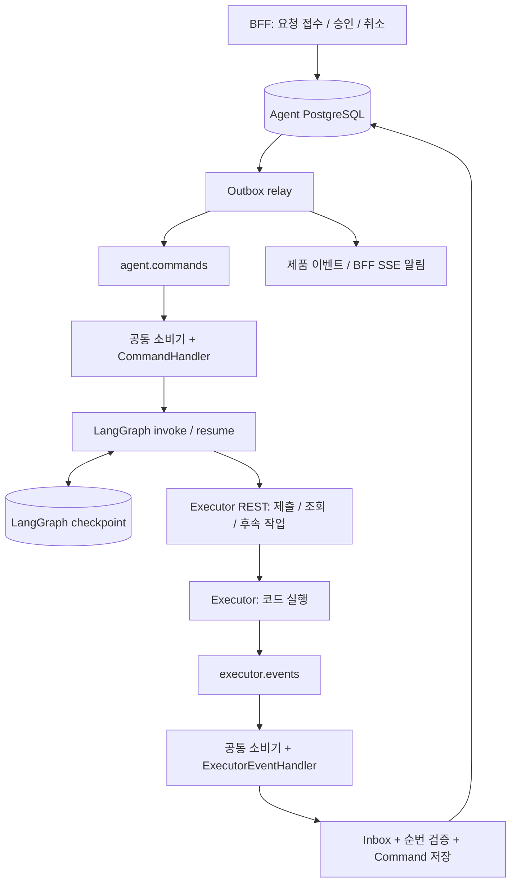

# 현재 ex-agent Worker 구현 참조

이 문서는 최초 요청부터 Worker에서 실행하는 현재 서비스의 구현 기록이다.
인수인계 대상인 **API+Agent / Worker** 구조는
[Worker 인수인계 가이드](worker-handoff-guide.md)를 기준으로 개발한다.
아래의 현재 API/Worker 호출 경로를 대상 서비스에 그대로 적용하지 않는다.

작성일: 2026-08-31. 기준 소스: `main`, `5099c2a`.

대상은 기존 LangGraph Agent에 Redis 소비 및 Executor 이벤트 기반 재개를
이식하려는 개발자다. 별도 배포 패키지 제작이나 기존 Agent 교체는 요구하지
않는다. **현재 구현**, **복사 가능한 코드**, **이식 시 구현할 부분**을 구분한다.
파일 경로는 이 저장소 루트 기준이다.

## 1. 인수인계 결론

- `src/ex_agent/transport/consumer.py`는 한 파일로 가져갈 수 있다.
  외부 의존성은 `redis`이며 LangGraph/DB/Agent 의존은 없다.
- 이벤트별 정책과 LangGraph 재개는 소비기 자체의 기능이 아니다.
  Handler, 영속 저장소, 이벤트 변환기, Graph runner를 연결해야 한다.
- 연결은 `examples/durable_event_to_langgraph/`를 출발점으로 삼는다.
  단, 예제의 메모리 저장소를 운영에 사용해서는 안 된다.
- 현재 PostgreSQL 구현은 참고·이식할 수 있지만 `agent_*` 테이블과
  Task/Executor 계약에 연결되어 있다. 폴더 복사만으로 임의의 Agent에
  연결되는 범용 Worker SDK가 완성되는 상태는 아니다.

권장 순서: **소비기 복사 → 예제 이해 → 자기 DB/Executor 어댑터 연결 →
자기 그래프 연결 → 장애 복구 검증**. 분석 함수, 프롬프트, Skill 시스템은
기존 Agent 것을 유지한다.

## 2. 무엇이 어디서 실행되는가



첫 소비 루프는 외부 이벤트를 잃지 않게 접수하고, 두 번째 루프는 Agent 작업을
수행한다. 모든 이벤트를 그대로 재발행하거나 단계마다 새 큐를 추가하지 않는다.
현재 Worker 한 프로세스에서 두 소비 루프, outbox relay, 상태/지표 루프가 실행된다.

| 구분 | 담당 |
|---|---|
| BFF/API | 사용자 검증, ID 전달, 요청 DB 저장, 조회/SSE |
| 공통 소비기 | Redis 수신, lease, 재전달, ACK/DLQ, 종료 처리 |
| 이벤트 Handler/Processor | 파싱, 실행 연결, 중복/순번, 경계 이벤트 판별 |
| DB/Outbox | 접수 사실과 실행할 Command 영속화, Redis 발행 복구 |
| Command Handler/Runner | 작업 직렬화, checkpoint 선택, invoke/resume |
| Agent 그래프 | 계획/승인, 결과 해석, SINGLE/MULTI 다음 행동, 종료 |
| Executor | 코드 실행, 실행 상태/결과, 노트북/아티팩트 |

BFF는 신뢰된 `user_id`와 채번한 `project_id/session_id/task_id`를 전달한다.
원본 API는 `X-User-ID`, 요청 body의 `task_id/input_message_id`를 사용한다.
이식 중 ID를 다시 생성하거나 Redis message ID를 업무 ID로 대체하지 않는다.
공개 API의 audit 필드와 다건 cursor 조회 규칙은
[API 규칙](api-conventions.md)을 유지한다.

실행에 며칠이 걸려도 Worker가 HTTP 요청이나 소비 슬롯을 며칠간 붙잡지 않는다.
제출 응답과 `execution_id`를 저장하고 그래프를 중단한 뒤 반환한다.
이벤트가 도착하면 다른 Worker도 같은 checkpoint를 이어갈 수 있어야 한다.
API와 Worker가 같은 Pod여도 별도 프로세스/컨테이너로 실행할 수 있다.
Pod나 프런트 연결의 생명주기를 작업의 생명주기로 사용하지 않는다.

## 3. 전달할 파일과 교체 경계

### 3.1 그대로 가져갈 코드

| 경로 | 전달 방법 |
|---|---|
| `src/ex_agent/transport/consumer.py` | 필수. 독립 파일로 복사 |
| `src/ex_agent/transport/dlq.py` | 권장. DLQ 조회/replay/discard 모듈 |
| `src/ex_agent/transport/stream_maintenance.py` | 선택. 안전한 Stream trim |
| `tests/test_stream_consumer.py` | 소비기 계약. import 경로 변경 |
| `tests/test_stream_consumer_integration.py` | 실제 Redis 복구 검증. fixture 확인 |
| `examples/durable_event_to_langgraph/` | 연결 예제. 저장소/계약/그래프 교체 |

`transport/__init__.py`는 다른 모듈을 재수출한다. 한 파일만 가져갈 때는 대상
패키지의 `__init__.py`를 별도로 구성한다. `transport/streams.py`는 현재
서비스의 DB/설정에 의존하는 outbox relay이므로 독립 소비기에 포함하지 않는다.

이식 대상 배치의 예시이며, 이번에 아래 디렉터리를 생성한 것은 아니다.

```text
your_agent/
  messaging/
    consumer.py          # 그대로 복사
    dlq.py               # 선택 복사
    contracts.py         # 자기 외부 이벤트 / 내부 Command 계약
    handlers.py          # 예제 기반 어댑터
    event_bridge.py      # DB 트랜잭션 + 이벤트 정책
    command_store.py     # 영속 Command 조회 / 상태 전이
    outbox.py            # DB -> Redis 발행 및 복구
  workflow/
    runner.py            # 자기 그래프 invoke/resume 어댑터
  worker_main.py         # 조립, SIGTERM, 자원 정리
```

예제에서 바꿀 import:

- `ex_agent.transport.consumer` → 자신의 `messaging.consumer`
- `examples.durable_event_to_langgraph.*` → 자신의 계약/Handler/Runner 경로

`memory_store.py`는 테스트 전용이다. 운영 경로로 가져가 사용하지 않는다.
의존성은 원본 [pyproject.toml](../pyproject.toml)과 `uv.lock`을 기준으로
대상 프로젝트와 맞춘다. 현재 저장소는 Python 3.12 이상, Redis 서버 통합 테스트는
7.4 standalone 기준이다. 소비기만 이식할 때 LangChain 전체는 필요 없다.

### 3.2 현재 서비스에서 참고할 코드

아래 `workers/`, `persistence/` 등은 모두 `src/ex_agent/` 아래다.

| 관심사 | 현재 파일 |
|---|---|
| Worker 조립/소비기 설정 | `worker.py`, `workers/consumers.py` |
| Handler | `workers/handlers.py` |
| 이벤트 순번 복구/변환 | `workers/executor_events.py` |
| Inbox/실행 binding 트랜잭션 | `persistence/repositories/executions.py` |
| Command 상태/실패 보상 | `persistence/repositories/commands.py` |
| Outbox claim/확정 | `persistence/repositories/delivery.py` |
| Redis 발행 | `transport/streams.py` |
| Graph 호출 | `workers/commands.py` |
| Thread ID/직렬화 | `workers/checkpoints.py` |
| Pool/슬롯/종료 | `workers/runtime.py`, `worker_main.py` |
| Executor REST/wire 계약 | `executor/client.py`, `executor/contracts.py` |
| 제출/결과 대조 | `application/capabilities/execution.py` |

현재 `WorkerRuntime`은 `build_workflow_graph()`와 서비스 의존성을 직접 조립한다.
환경 변수에 자기 그래프 경로만 넣어 교체하는 구조가 아니다.
기존 Agent를 유지하려면 새 진입점에서 소비기와 자기 Runner를 조립한다.

## 4. 실제 이벤트 / 내부 Command / resume 계약

### 4.1 Executor → 외부 이벤트 소비기

기본 Stream은 `executor.events`, group은 `agent-executor-events-v1`이다.
Redis field map은 `dict[str, str]`이며 `payload`만 JSON 문자열로 파싱한다.
아래는 Agent 수신 모델의 최소 설명용 예시다. 실제 Executor의 이벤트별
`payload`에는 추가 정보가 들어갈 수 있다.

```json
{
  "event_id": "00000000-0000-4000-8000-000000000001",
  "event_type": "execution.operation_completed",
  "schema_version": "1.0",
  "execution_id": "00000000-0000-4000-8000-000000000002",
  "event_sequence": "5",
  "payload": "{}",
  "occurred_at": "2026-08-31T09:00:00Z"
}
```

| 수신 `event_type` | 현재 처리 | Graph 재개 Command |
|---|---|---|
| `execution.started` | 진행 이력/순번 저장 | 생성 안 함 |
| `execution.operation_started` | 진행 이력/순번 저장 | 생성 안 함 |
| `execution.step_started` | 진행 이력/순번 저장 | 생성 안 함 |
| `execution.step_completed` | 진행 이력/순번 저장 | 생성 안 함 |
| `execution.operation_completed` | 경계 접수 | `EXECUTOR_SIGNAL` |
| `execution.completed` | 경계 접수 | `EXECUTOR_SIGNAL` |

현재 수신 모델은 이 6개 타입과 schema `1.0`을 검증한다. 지원하지 않는
타입/스키마나 잘못된 JSON은 영구 오류로 DLQ 처리된다. 외부 서비스가 이벤트를
추가할 때는 계약과 테스트도 함께 변경해야 한다.

MULTI는 현재 한 Operation에 한 셀을 제출하므로 다음 계획의 경계는
`step_completed`가 아니라 `operation_completed`다. `completed`라는 이름만으로
성공 리포트를 생성하지 않는다. 실제 성공/실패/취소는 REST 결과와 대조한다.

### 4.2 내부 Command는 외부 이벤트와 다른 계약

기본 Stream은 `agent.commands`, group은 `agent-workflow-workers-v1`이다.
실제 발행 field는 아래 네 가지다. `payload`는 JSON 문자열이다.
긴 이스케이프 문자열 대신 같은 field map을 만드는 Python으로 표기한다.

```python
import json

command_fields = {
    "command_id": "00000000-0000-4000-8000-000000000003",
    "task_id": "00000000-0000-4000-8000-000000000004",
    "command_type": "EXECUTOR_SIGNAL",
    "payload": json.dumps(
        {
            "type": "EXECUTOR_BOUNDARY",
            "execution_id": "00000000-0000-4000-8000-000000000002",
            "event_id": "00000000-0000-4000-8000-000000000001",
            "event_sequence": 5,
            "event_type": "execution.operation_completed",
        }
    ),
}
```

| `command_type` | 생성 주체 | 처리 |
|---|---|---|
| `START` | 요청 접수 | 초기 state로 `ainvoke()` |
| `RESUME` | 사용자 입력/승인/취소 접수 | DB payload로 `Command(resume=...)` |
| `EXECUTOR_SIGNAL` | 외부 이벤트 접수 | DB payload로 `Command(resume=...)` |
| `FAILURE_COMPENSATION` | Agent 처리의 최종 실패 | Executor 종료 확인 후 실패 확정 |

현재 Handler는 Redis의 `command_id`로 PostgreSQL Command를 다시 읽는다.
`command_type`과 업무 payload의 원본은 DB다. Redis에 `XADD`만 한다고
작업이 만들어지는 것이 아니다. 작업 생성은 BFF/API 또는 영속 Command
생성 서비스로 수행한다.

### 4.3 실제 LangGraph에 전달되는 값

아래 객체를 `Command(resume=command.payload)`로 전달한다.
Redis envelope 전체, 코드 전체, 노트북 전체를 전달하지 않는다.

```json
{
  "type": "EXECUTOR_BOUNDARY",
  "execution_id": "00000000-0000-4000-8000-000000000002",
  "event_id": "00000000-0000-4000-8000-000000000001",
  "event_sequence": 5,
  "event_type": "execution.operation_completed"
}
```

이 값은 `wait_external_signal()`의 `interrupt()` 반환값이 된다. 다음 노드는
Executor REST 결과를 조회하고 결과 참조 파일의 정합성을 검증한다.
현재 checkpoint 키는 **`thread_id = str(task_id)`**다. 사용자 대화
`session_id`와 혼동하지 않는다. 한 세션의 다른 Task는 별도 checkpoint를 쓴다.

예제 디렉터리의 `workflow_id`, `RESUME`, `workflow.step_completed`는 범용
설명용 이름으로 실제 Executor wire 계약과 다르다. 예제의 `workflow_id`는
재개 대상 작업 키이며, 서비스의 승격된 Workflow ID와도 다르다.

### 4.4 UI 알림은 세 번째 종류의 메시지

`agent.product-events`에는 `event_id`, `task_id`, `event_type`, JSON 문자열
`payload`가 실린다. Task별 Pub/Sub은 BFF/SSE를 깨우는 알림이다.
Graph 재개 Command가 아니다. 재연결 시에는 PostgreSQL Task event 이력과
`Last-Event-ID`로 복원한다. UI Stop은 관찰 중단이며 실행 취소는 별도 요청이다.

## 5. 이식 개발: 단계별 할 일

### 단계 A. 소비기만 붙여서 검증

`Redis.from_url(..., decode_responses=True)`로 비동기 클라이언트를 생성한다.
Handler는 두 메서드를 구현한다.

```python
class MyHandler:
    def lock_key(self, message: StreamMessage) -> str | None:
        # 같은 업무를 직렬화하는 키. fields는 먼저 검증한다.
        return make_business_lock_key(message)

    async def handle(self, message: StreamMessage) -> HandlerResult:
        await commit_idempotent_effect(message)
        return HandlerResult(AckDecision.ACK)
```

계약 설명용 코드다. `make_business_lock_key()`와
`commit_idempotent_effect()`는 개발자가 구현한다. 실제 조립 문법은
[소비기 사용 예시](redis-stream-consumer.md)를 참조한다.

- 소비기는 group 생성, `XREADGROUP`, `XAUTOCLAIM`, lock/PEL 갱신을 담당한다.
- `ACK`는 영속 처리가 끝났다는 뜻이다. Handler에서 직접 `XACK`하지 않는다.
- `RETRY`는 PEL에 남긴다. 설정한 실패 횟수를 소진하면 DLQ로 이동한다.
- 파싱 불가능한 입력은 `PermanentMessageError`로 분류한다.
- lock 경합은 업무 실패 횟수에 포함되지 않는다.
- 메시지마다 무제한 `create_task()`를 하지 않고 소비기의 슬롯 상한을 쓴다.

### 단계 B. 외부 이벤트를 영속 Command로 변환

예제의 `DurableEventBridge.accept()`를 PostgreSQL 어댑터로 구현한다.
현재 `ExecutionRepository.ingest_signal()`을 참고한다.

예제 [ports.py](../examples/durable_event_to_langgraph/ports.py)의 구현 책임:

| Port | 대상 Agent가 제공할 구현 |
|---|---|
| `DurableEventBridge.accept(event)` | Inbox/순번/Command의 원자적 저장 |
| `CommandStore.get_command(id)` | DB의 authoritative Command 조회 |
| `mark_processing / mark_done / mark_retry` | 처리 상태/시도/오류 영속화 |
| `WorkflowRunner.start / resume` | 자기 Graph와 checkpoint 연결 |

추가로 outbox relay와 `execution_id → 작업 키` binding 저장소가 필요하다.
자기 DB를 쓰면 테이블 이름은 바꿔도 되지만 unique 제약과 트랜잭션 경계를
유지한다. 원본 migration 전체는 분석/Workflow 테이블까지 포함하므로
기존 Agent DB에 그대로 적용하지 않는다.

1. `execution_id → task_id/thread_id` binding을 조회한다.
2. Redis 락과 별개로 DB에서 실행별 순번 row를 잠그고 검증한다.
3. `(stream, event_id)` 기준으로 Inbox 중복을 제거한다.
4. 순번이 비었으면 Executor history API로 확보해 순서대로 반영한다.
5. 진행 이벤트는 이력만, 경계 이벤트는 Command와 UI 이력을 함께 저장한다.
6. **Inbox, 순번 전진, 해당 Command/이력은 같은 트랜잭션으로 commit한다.**
7. commit 후에만 외부 메시지를 ACK할 수 있다.

현재 Inbox의 `message_id`에는 Redis entry ID가 아니라 `event:{event_id}`가
저장된다. replay로 Redis ID가 바뀌어도 중복 처리하지 않기 위해서다.
경계 Command의 멱등 키는 `executor-event:{event_id}`다.

제출 직후 event가 binding보다 먼저 도착하면 현재는 ACK하지 않고 재전달을
기다리며, 재claim 때 history도 조회한다. 다른 서비스 실행이나 과거 데이터처럼
**영원히 binding이 생기지 않을 이벤트**는 별도 소유권/무시 정책이 필요하다.
현재 서비스는 이 경우도 재시도 후 DLQ 대상이 될 수 있다.
binding이 없다고 모두 ACK하면 정상 조기 도착 이벤트를 잃는다.

### 단계 C. Outbox와 재시도 책임 연결

현재는 별도 `outbox` 테이블 대신 `agent_workflow_commands`의
`state/publish_claimed_at`으로 Command outbox를 구현한다.
`agent_task_events`는 `delivery_state`를 갖는 제품 이벤트 outbox다.

relay는 `FOR UPDATE SKIP LOCKED`로 발행 대상을 claim하고 Redis 발행 후
DB 상태를 확정한다. DB commit과 Redis 발행은 분산 트랜잭션이 아니므로
응답 유실 시 중복 메시지는 가능하다. 재발행 시 `command_id`는 유지한다.
즉시 발행뿐 아니라 미발행/기한 초과 claim을 회수하는 루프도 둔다.

| 경로 | 실패 시 메시지 처리 | 재시도 책임 |
|---|---|---|
| 현재 Executor 이벤트 Handler | ACK하지 않음 | Redis PEL |
| 현재 서비스 Command Handler | DB `PENDING` 저장 후 ACK | DB outbox 재발행 |
| 일반화 예제 Command Handler | 상태 복원, `RETRY` 반환 | Redis PEL |

현재 정상 흐름은 `PENDING → PUBLISHING → PUBLISHED → PROCESSING → DONE`이다.
소비가 빨라 `PROCESSING`으로 먼저 바뀌어도 발행 확정이 이를 덮어쓰지 않도록
DB 갱신 조건을 둔다.

**한 실패에 `RETRY`와 새 outbox 발행을 동시에 사용하지 않는다.**
다만 프로세스 종료처럼 Handler가 DB 실패 처리를 마치지 못하면 현재 서비스도
PEL로 복구한다. “DB 재시도 사용”이 Redis 장애 복구 제거를 뜻하지 않는다.

현재는 Graph 업무 실패를 3회 시도한 뒤 동일 Command를
`FAILURE_COMPENSATION`으로 바꾼다. 소비기의 `COMMAND_MAX_RETRY_ATTEMPTS`와
다른 정책이다. 보상 실패는 다시 `PENDING`으로 돌아가므로 장기 미완료 보상의
운영 알림/개입도 필요하다.

### 단계 D. 기존 그래프를 Runner 뒤에 연결

노드 안에서 Redis를 직접 읽지 않는다. Runner가 새 요청과 재개를 구분하고,
그래프는 검증된 state와 resume payload만 받게 한다.

1. 최초 state와 안정적인 `thread_id`로 시작한다.
2. 별도 노드에서 Executor에 제출하고 응답/binding을 저장한다.
3. 다음 대기 노드에서 `interrupt()`로 멈추고 소비 슬롯을 반환한다.
4. 경계 Command를 받으면 대상 작업/실행/현재 대기 종류를 검증한다.
5. 동일 checkpoint 저장소와 `thread_id`로 `Command(resume=...)`를 전달한다.
6. REST 결과에 따라 다음 작업, 성공 리포트, 실패 또는 취소로 분기한다.

운영 checkpointer는 `AsyncPostgresSaver`를 사용한다. 현재처럼
`AsyncConnectionPool`은 공유하되 슬롯별 saver/graph를 두는 구성을 참고한다.
현재 runtime은 첫 saver에서 `setup()`을 실행한다. 이식 시 배포 단계의
스키마 설치 주체와 Worker 초기화 순서를 명확히 정한다.

재개 시 `interrupt()`가 있는 노드는 처음부터 다시 실행된다. 제출, 파일 쓰기,
외부 API 등은 안정적인 멱등 키가 필요하다. 노드를 나누는 것만으로 모든 장애
구간의 exactly-once가 보장되지 않는다. 일반 dict 입력은 신규 입력이며
`Command(resume=...)`와 의미가 다르다.

### 단계 E. 순서와 중복 재개 보강

같은 task 락은 **동시 실행을 막지만 FIFO를 보장하지 않는다**. 다른 슬롯의
claim이나 DB 재발행으로 Command 적용 순서가 달라질 수 있다.
운영 이식에서는 다음 조건을 직접 충족해야 한다.

- 같은 `command_id`의 완료 여부와 checkpoint 적용 여부를 확인한다.
- 오래된 이벤트가 새 승인/새 Operation의 대기를 해제하지 않도록 한다.
- 실행 ID/binding, sequence, 예상 대기 단계를 검증한다.
  해당 구현의 Operation 식별 계약도 정한다.
- Command 순서를 DB에서 제한하거나 checkpoint에 처리 영수증을 남겨
  뒤늦게 재전달된 이전 Command도 판별한다.
- checkpoint 저장 직전/직후, DB `DONE` 직전/직후 장애를 주입한다.

예제의 `last_command_id`는 **마지막 Command의 checkpoint 후 DB DONE 전에
중단된 경우**를 보여주는 최소 장치다. 과거 Command 전체의 중복 방지, 노드 중간
복구, 모든 순서 역전까지 해결한 범용 구현이 아니다. 현재 서비스의
`CommandProcessor.run_graph()`에도 이 예제와 같은 `last_command_id` 검사 자체는
없다. 기존 DB/외부 API 멱등성만 보고 새 그래프까지 안전하다고 가정하지 말고
이 조건들을 인수 테스트로 추가한다.

## 6. 연결을 이해하는 실행 가능한 예제

저장소 루트에서 실행한다. Redis, Executor, LLM을 호출하지 않는
**메모리 기반 Handler → Command → LangGraph 테스트**다.
실제 Redis 소비 루프와 재시작 내구성은 다음 절에서 별도로 검증한다.

```bash
uv run --no-sync python - <<'PY'
import asyncio
import json
from uuid import uuid4

from langgraph.checkpoint.memory import InMemorySaver

from ex_agent.transport.consumer import StreamMessage
from examples.durable_event_to_langgraph.handlers import (
    DurableCommandHandler,
    ExternalEventHandler,
)
from examples.durable_event_to_langgraph.memory_store import (
    InMemoryDurableStore,
)
from examples.durable_event_to_langgraph.workflow import (
    LangGraphWorkflowRunner,
    build_workflow,
)


async def main():
    store = InMemoryDurableStore()
    runner = LangGraphWorkflowRunner(build_workflow(InMemorySaver()))
    await runner.start("handoff-task-1", "이벤트 수신 후 재개 테스트")
    event = StreamMessage(
        "1-0",
        {
            "event_id": str(uuid4()),
            "workflow_id": "handoff-task-1",
            "sequence": "1",
            "event_type": "workflow.completed",
            "payload": json.dumps({"result": "ok"}),
        },
    )
    await ExternalEventHandler(store).handle(event)
    handler = DurableCommandHandler(store, runner)
    message = StreamMessage("2-0", store.outbox[0])
    first = await handler.handle(message)
    second = await handler.handle(message)
    state = await runner.state("handoff-task-1")
    assert state["terminal"] is True
    assert state["applied_count"] == 1
    assert second.outcome == "duplicate"
    print(first.outcome, second.outcome, state["applied_count"])


asyncio.run(main())
PY
```

예상 출력: `applied duplicate 1`.

## 7. 실행 환경과 운영 설정

### 7.1 원본 프로젝트를 먼저 실행할 때

`.env`가 있으면 덮어쓰지 않는다. 없으면 `.env.example`을 복사해 작성한다.
Executor PostgreSQL 서버/Redis를 공유하되 Agent DB는 별도로 사용한다.
DB 생성은 [공유 인프라 설정](shared-executor-infrastructure.md)을 따른다.

필수 확인값:

- `AGENT_DATABASE_URL`: Agent DB. Executor 업무 DB에 migration 금지.
- `AGENT_CHECKPOINT_DATABASE_URL`: 같은 Agent 데이터 수명의 checkpoint DB.
- `AGENT_REDIS_URL`: Executor 이벤트가 발행되는 Redis의 같은 DB 번호.
- `EXECUTOR_BASE_URL`: `/api/v1`까지 포함한 Executor REST 주소.
- `EXECUTOR_SHARED_DIR`: 호스트의 **실제 Executor 공유 디렉터리 절대경로**.
- `EXECUTOR_SHARED_STORAGE_ROOT`: 컨테이너에서는 `/workspace/shared`.
- 모델 설정/호스트 매핑: `.env.example`을 자신의 환경과 대조한다.

`/path/to/executor/shared_dir`는 예시다. 그대로 실행하면 mount 오류가 난다.
코드와 리포트는 `source.type=PATH`, 상대경로와 SHA-256으로 전달한다.
Agent와 Executor가 같은 공유 파일을 볼 수 있어야 한다.

수일 실행은 HTTP timeout, 셀 실행 timeout, MULTI 후속 입력 대기 timeout,
이벤트 보존기간을 각각 구분해서 설정한다. 현재 계획 셀 timeout은 기본 300초,
계획 스키마상 상한은 432,000초이며 Executor 허용 범위도 확인해야 한다.
비동기 Worker라는 이유만으로 기본 설정에서 5일 실행이 자동 허용되지는 않는다.
세부 REST 계약은 [Executor 연동 참조](executor-integration-reference.md)를 따른다.

```bash
uv sync --no-editable
docker compose config --quiet
docker compose up -d --build api worker
docker compose ps
curl -fsS http://localhost:8010/readyz
curl -fsS http://localhost:8011/readyz
```

기본 Compose는 의존하는 `migrate`를 포함해 API/Worker만 기동하고 DB/Redis는
외부 인프라를 사용한다. `/readyz`는 DB/Redis를 확인하지만 모델/Executor REST나
Jupyter 실행 슬롯 여유를 보장하지 않는다.

위 명령은 **원본 서비스 검증용**이다. 이식 대상은 자신의 Worker 진입점과
DB migration을 구성해야 한다. Chat UI가 필요하면
[Chat UI 테스트](agent-chat-ui-testing.md)를 참고한다. UI용 그래프가 Worker의
업무 그래프를 대신 실행하는 구조로 바꾸지 않는다.

### 7.2 소비기 설정과 충돌 방지

| 설정 | 현재 서비스 기본값 / 주의 |
|---|---|
| Command concurrency | `WORKER_COMMAND_CONCURRENCY=4` |
| Executor 이벤트 concurrency | `WORKER_EXECUTOR_EVENT_CONCURRENCY=8` |
| reclaim idle | Command/이벤트 기본 30초 |
| task/실행 lock TTL | 60초 |
| lock/PEL 갱신 | 10초. TTL 및 reclaim idle보다 짧게 |
| shutdown grace | 25초. 플랫폼 종료 유예는 이보다 길게 |
| checkpoint pool | min 1, max 8 |
| group 시작 위치 | 소비기 기본 `0`: 기존 보존 이벤트부터 |
| consumer 식별 | 배포 instance마다 고유한 `consumer_prefix` |

소비기 자체는 환경 변수를 읽지 않는다. 위 값은 현재 서비스의
`Settings → RedisStreamConsumerConfig` 연결 결과다. 이식 시 같은 연결을 구현한다.

- 같은 업무를 분담하는 replica는 같은 group, 서로 다른 consumer 이름을 쓴다.
- 기존/새 Agent가 독립적으로 이벤트를 받으려면 다른 group을 쓴다.
  Command Stream, DLQ, lock 접두사, DB/checkpoint도 서비스별로 구분한다.
- 신규 group의 `0`/`$` 선택은 과거 복구 여부에 영향을 준다.
  backlog 해결을 위해 임의로 `$`를 적용하면 과거 이벤트를 놓칠 수 있다.
- 현재 Compose `environment`는 명시 목록이다. `.env`에 Stream/group 변수를
  추가하는 것만으로 컨테이너에 전달되지 않는 항목이 있다. 이름 변경 시
  Compose `environment`에도 연결하고 실제 컨테이너 값을 확인한다.
  `.env` 전체나 인증정보를 로그/공유 문서에 출력하지 않는다.
- Redis Cluster는 검증 대상이 아니다. DLQ 원자 처리에 관련된 key의
  hash slot 등은 별도 설계/검증이 필요하다.

종료는 SIGTERM → 새 수신 중단 → Handler drain → 유예 초과 취소 →
자원 정리 순서다. 취소된 메시지는 ACK하지 않아 다른 Worker가 재claim한다.
Redis 연결은 소비기 호출자가 닫는다.

## 8. 테스트와 인수 기준

### 8.1 원본 코드 회귀 테스트

```bash
uv run --no-sync ruff check .
uv run --no-sync ruff format --check .
uv run --no-sync ty check
uv run --no-sync python -m pytest \
  tests/test_architecture.py \
  tests/test_stream_consumer.py \
  tests/test_durable_event_to_langgraph_example.py \
  tests/test_executor_event_ordering.py \
  tests/test_worker_checkpoint_scope.py \
  tests/test_worker_failure_compensation.py
```

실제 DB/Redis 검증은 운영 인프라가 아닌 격리 `test` profile에서 수행한다.
이 명령은 테스트 컨테이너와 테스트 DB migration을 만든다.

```bash
docker compose --profile test build test-migrate test
docker compose --profile test run --rm test
```

주요 근거 테스트는 모두 `tests/` 아래다.

| 파일 | 검증 범위 |
|---|---|
| `test_architecture.py` | 소비기 단독 import, 도메인 의존 없음 |
| `test_stream_consumer.py` | ACK 시점, retry/DLQ, lease, drain |
| `test_stream_consumer_integration.py` | 실제 Redis, 종료 후 다른 runtime reclaim |
| `test_worker_event_integration.py` | 역순/history 보충, binding 조기 도착 |
| `test_durable_event_to_langgraph_example.py` | 재개, checkpoint/DONE 사이 복구 |
| `test_worker_checkpoint_scope.py` | 동일 세션의 Task checkpoint 분리 |
| `test_worker_failure_compensation.py` | 실패 시 Executor 취소/종료 확인 |

### 8.2 이식된 Agent의 인수 체크리스트

- [ ] 기존 프롬프트/분석 기능을 유지한 채 자기 Worker가 시작된다.
- [ ] 승인, 실행 binding 저장, 이벤트 기반 재개, 결과 반영이 이어진다.
- [ ] 진행 이벤트는 이력만 갱신하고 LLM/Graph를 불필요하게 재개하지 않는다.
- [ ] 중복 event와 재발행 Command가 작업/리포트를 중복 생성하지 않는다.
- [ ] 역순/누락 이벤트와 binding보다 빠른 이벤트가 복구된다.
- [ ] DB commit 전 장애: ACK되지 않으며 재전달된다.
- [ ] DB commit 후 Redis 발행 전 장애: outbox relay가 복구한다.
- [ ] Redis 발행 후 DB 발행확정 전 장애: 같은 Command로 중복 수렴한다.
- [ ] Graph 노드 실행 중/체크포인트 후 DONE 전 종료 모두 안전하게 복구한다.
- [ ] 이전 Command의 지연 재전달이 새로운 대기/승인을 해제하지 않는다.
- [ ] Worker 교체 후 동일 task/thread checkpoint를 이어간다.
- [ ] 동일 Task 직렬화와 서로 다른 Task 병렬 처리가 성립한다.
- [ ] retry 상한/DLQ/replay/알림이 동작하고 실패를 조용히 ACK하지 않는다.
- [ ] 취소 접수와 실제 실행 취소 완료를 구분한다.
- [ ] 성공 리포트 완료 또는 실패/취소 확인까지 세션 잠금이 유지된다.
- [ ] 장기 실행 중 UI를 닫아도 실행이 유지되고 재연결 시 상태가 복원된다.

원본 테스트 통과가 대상 DB/새 Graph의 내구성을 증명하지는 않는다.
중복 재개와 노드 중간 장애는 대상 Agent의 외부 부수 효과를 포함해 검증한다.

### 8.3 이전 인수인계 문서 작성 시 검증 기록

아래는 Worker 중심 문서의 이전 검증 기록이다. API+Agent 연결 예제를 추가한
현재 검증 결과는 [새 인수인계 가이드](worker-handoff-guide.md)를 확인한다.

- 2026-08-31: 위 로컬 회귀 테스트 46개 통과.
- 6절 예제 실행 결과: `applied duplicate 1`.
- 이벤트/Command/resume 예시의 직렬화 및 실제 수신 모델 검증 통과.
- Ruff lint/format, ty, 문서 링크와 79자 줄 길이 검사 통과.
- 이번 문서 작업에서는 실제 Executor/LLM E2E나 Docker 통합 테스트를 재실행하지
  않았다. 8.1절의 Compose 명령은 이식 개발자의 재검증 절차다.

## 9. 인수 범위 밖 / 알려진 후속 사항

- 전달물은 소비기 모듈과 참조 구현이다. 범용 PostgreSQL Bridge/Runner를
  주입하는 완성 SDK나 독립 패키지 배포는 이번 범위가 아니다.
- Stream 정리는 모듈/CLI가 있다. 관리 API는 후속 작업이다.
- 공용 Stream의 타 서비스 이벤트 판별과 운영 Command 순서/영수증 정책은
  이식 시 확정한다. 예제의 제한은 5절을 따른다.
- 최근 노트북 다운로드 잘림은 Executor의 가변 파일과 아티팩트 크기/체크섬
  불일치 문제다. 소비기 문제는 아니지만 수정 전에는 다운로드 인수 테스트의
  별도 실패 항목으로 관리한다. Agent의 `append_to_notebook=true` 요청은
  노트북 파일을 변경하는 경로 중 하나다.
- MULTI 계획 이력/리포트 품질 후속 항목은
  [Skill/MULTI 검증 기록](skill-selection-fix.md)을 참고한다.

## 10. 개발자에게 전달할 요약

> Redis 소비 루프는 새로 만들지 말고 `transport/consumer.py`를 가져가세요.
> 기존 Agent는 유지하고 `durable_event_to_langgraph` 예제를 바탕으로
> 이벤트 Handler, PostgreSQL Bridge/Command 저장소, outbox relay,
> LangGraph Runner를 연결하면 됩니다. 현재 서비스 코드는 DB 구현의 참고입니다.
> 진행 이벤트는 저장만 하고 실행 경계에서만 내부 Command로 그래프를 재개하세요.
> 메모리 저장소를 운영에 쓰지 말고 PEL 재시도와 DB 재발행을 혼합하지 마세요.
> 재시작, 중복/역순, checkpoint와 DB 사이 장애 검증까지가 인수 완료 기준입니다.
