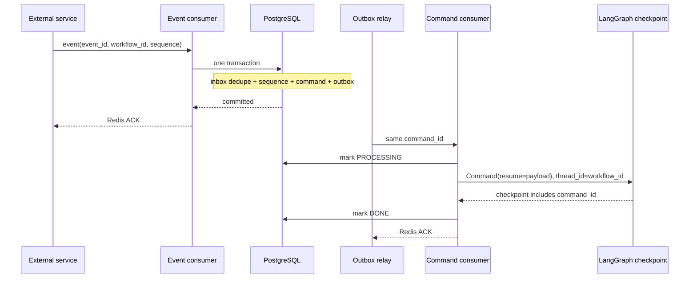

# Durable event to LangGraph

이 디렉터리는 외부 서비스 이벤트를 받아 LangGraph를 안전하게 재개하는
최소 참조 구현이다. `ex_agent`의 분석 도메인, Executor 계약, repository를
가져가지 않으며 아래 구성만 복사해서 다른 Agent에 맞게 구현할 수 있다.

- `contracts.py`: 외부 이벤트와 내부 커맨드의 최소 wire 계약
- `ports.py`: 영속 저장소와 LangGraph 실행기의 교체 가능한 경계
- `handlers.py`: 공통 Redis 소비기에 연결하는 두 handler
- `workflow.py`: `thread_id`와 command ID 중복 방지를 포함한 LangGraph 예제
- `memory_store.py`: 테스트 전용 원자성 모형. 운영 저장소가 아니다.

## 전체 흐름



외부 이벤트 consumer가 LangGraph를 직접 재개하지 않는 이유는 Redis ACK와
checkpoint 쓰기 사이의 장애 경계를 분리하기 위해서다. 첫 consumer는
이벤트를 하나의 DB 트랜잭션으로 내부 커맨드까지 확정한 후에만 ACK한다.
두 번째 consumer는 그 확정된 커맨드를 실행한다.

## 반드시 지켜야 하는 불변식

1. `event_id`에는 unique 제약을 두고 inbox 중복을 제거한다.
2. 같은 workflow의 `sequence`는 DB row lock 안에서 검증한다.
3. inbox, sequence, command, outbox는 하나의 트랜잭션으로 기록한다.
4. 트랜잭션 commit 전에는 외부 이벤트를 ACK하지 않는다.
5. 재발행할 때도 최초의 `command_id`를 그대로 사용한다.
6. 모든 LangGraph 호출에 `thread_id=workflow_id`를 전달한다.
7. 적용된 `command_id`를 checkpoint state에 함께 기록한다.
8. Redis PEL 재전달과 DB 재발행 중 재시도 책임자는 하나만 선택한다.
9. 메일, 결제 같은 외부 부수 효과에는 별도 idempotency key를 전달한다.

이 예제의 command handler는 Redis PEL을 재시도 책임자로 선택한다. 따라서
실패할 때 같은 command의 상태만 `PENDING`으로 되돌리고 새 메시지를 발행하지
않는다. DB outbox 재발행을 선택하려면 handler가 실패 메시지를 ACK하도록
바꾸고, DB 상태 머신과 relay가 재시도를 전적으로 소유하게 해야 한다.

## 운영 저장소 구현

`InMemoryDurableStore`는 테스트에서 트랜잭션의 결과를 설명하기 위한
모형이다. 운영에서는 `DurableEventBridge.accept()` 안에서 대략 다음 SQL
순서를 하나의 PostgreSQL 트랜잭션으로 수행한다.

1. workflow sequence row를 `SELECT ... FOR UPDATE`로 잠근다.
2. inbox에 `event_id`를 삽입한다. unique 충돌은 성공한 중복 처리다.
3. 기대 sequence와 다르면 commit하지 않고 재시도 가능한 오류를 낸다.
4. 경계 이벤트라면 결정적 command ID로 command를 삽입한다.
5. 같은 command envelope를 outbox에 삽입하고 sequence를 갱신한다.
6. commit 후에만 handler가 `ACK`를 반환한다.

LangGraph checkpointer도 운영에서는 `PostgresSaver`를 사용한다.
`InMemorySaver`는 프로세스 재시작 시 상태가 사라지므로 테스트 외에는 쓰지
않는다. checkpointer schema 설치와 connection pool 수명은 Agent 앱 수명과
함께 관리해야 한다.

## Redis consumer에 조립

두 handler는 이 프로젝트의 재사용 가능한
`ex_agent.transport.consumer.RedisStreamConsumer` protocol을 구현한다.
다른 저장소 구현을 주입한 뒤 다음처럼 조립한다.

```python
event_consumer = RedisStreamConsumer(
    redis,
    event_config,
    lambda _: ExternalEventHandler(postgres_event_bridge),
)

command_consumer = RedisStreamConsumer(
    redis,
    command_config,
    lambda _: DurableCommandHandler(command_store, workflow_runner),
)
```

외부 이벤트 schema가 다르면 공통 consumer는 수정하지 말고
`ExternalEvent.from_message()`에 해당 서비스의 adapter를 둔다. 이벤트를
커맨드로 바꾸는 정책도 `DurableEventBridge` 구현에 둔다. LangGraph node나
prompt가 Redis payload를 직접 해석하게 만들지 않는 것이 경계를 유지하는
핵심이다.

## 현재 ex-agent와의 대응

| 참조 구현 | 현재 서비스 구현 |
|---|---|
| `ExternalEventHandler` | `ExecutorEventHandler` |
| `DurableEventBridge` | `ExecutorEventProcessor` + repository transaction |
| `WorkflowCommand` | DB workflow command / `agent.commands` envelope |
| `DurableCommandHandler` | `CommandHandler` + `CommandProcessor` |
| `LangGraphWorkflowRunner` | `CommandProcessor.run_graph()` |

현재 서비스의 executor 경계 command type은 `EXECUTOR_SIGNAL`이며 payload는
`ExecutorBoundarySignal`이다. 이 예제의 `RESUME`은 특정 도메인 이름이 아닌
일반적인 설명용 이름이다. 이식 대상 서비스는 자기 이벤트 type과 resume
payload를 명시적으로 정의해야 한다.
